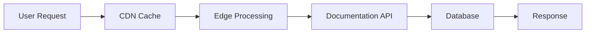

## Workspace Configuration

UltraStudio AI offers extensive customization options to match your documentation needs and brand guidelines.

<Steps>
  <Step title="Access Settings" icon="settings">
    Navigate to your workspace settings from the dashboard to configure global options.
  </Step>
  <Step title="Branding" icon="palette">
    Set your brand colors, logo, and custom domain for a professional appearance.
  </Step>
  <Step title="Navigation" icon="menu">
    Customize your navigation structure with tabs, groups, and nested sections.
  </Step>
  <Step title="Integrations" icon="plug">
    Connect external services like GitHub, Slack, and analytics platforms.
  </Step>
</Steps>

## Navigation Structure

<Tabs>
  <Tab title="Basic Setup" icon="layout">
    Create a simple tab-based navigation for straightforward documentation.
    
    <CodeGroup tabs="JSON,YAML">
      ```json
{
  "navigation": {
    "tabs": [
      {
        "tab": "Documentation",
        "groups": [
          {
            "group": "Getting Started",
            "pages": [
              {"title": "Introduction", "path": "introduction"}
            ]
          }
        ]
      }
    ]
  }
}
      ```
      ```yaml
navigation:
  tabs:
    - tab: Documentation
      groups:
        - group: Getting Started
          pages:
            - title: Introduction
              path: introduction
      ```
    </CodeGroup>
  </Tab>
  <Tab title="Advanced Structure" icon="grid">
    Use nested groups and dropdowns for complex documentation hierarchies.
    
    <Expandable title="Nested Groups" default-open="true">
      Create sub-sections within main groups for better organization.
    </Expandable>
  </Tab>
</Tabs>

<Callout kind="tip">Use our visual navigation builder to drag and drop sections without writing code.</Callout>

## Branding and Themes

<Columns cols={2}>
  <Card title="Color Schemes" icon="droplet" href="#colors" cta="Customize">
    Define primary and secondary colors for light and dark themes.
  </Card>
  <Card title="Custom Fonts" icon="type" href="#fonts" cta="Configure">
    Upload custom fonts or choose from our curated font library.
  </Card>
</Columns>

## API Integrations

<ExpandableGroup>
  <Expandable title="GitHub Integration" default-open="true">
    Connect your repository for automatic documentation syncing and version control.
    
    ```javascript
const githubConfig = {
  token: process.env.GITHUB_TOKEN,
  repo: 'organization/docs',
  branch: 'main'
};
    ```
  </Expandable>
  <Expandable title="Slack Notifications" default-open="false">
    Get notified about documentation updates and team activities.
  </Expandable>
  <Expandable title="Analytics" default-open="false">
    Track documentation usage and user engagement with integrated analytics.
  </Expandable>
</ExpandableGroup>

## Security Settings

<Callout kind="alert">Configure security settings carefully to protect sensitive documentation.</Callout>

| Setting | Description | Default |
|---------|-------------|---------|
| Public Access | Allow anonymous viewing | Disabled |
| Team Permissions | Control edit/view rights | Admin only |
| API Keys | Generate secure API tokens | None |
| Audit Logs | Track all changes | Enabled |

## Performance Optimization



Our platform automatically optimizes performance with global CDN distribution and intelligent caching.

## Troubleshooting

Common configuration issues and their solutions:

- **Navigation not updating**: Clear cache and refresh the page
- **Theme changes not applying**: Check for conflicting custom CSS
- **Integration failures**: Verify API keys and permissions

Contact support if issues persist.