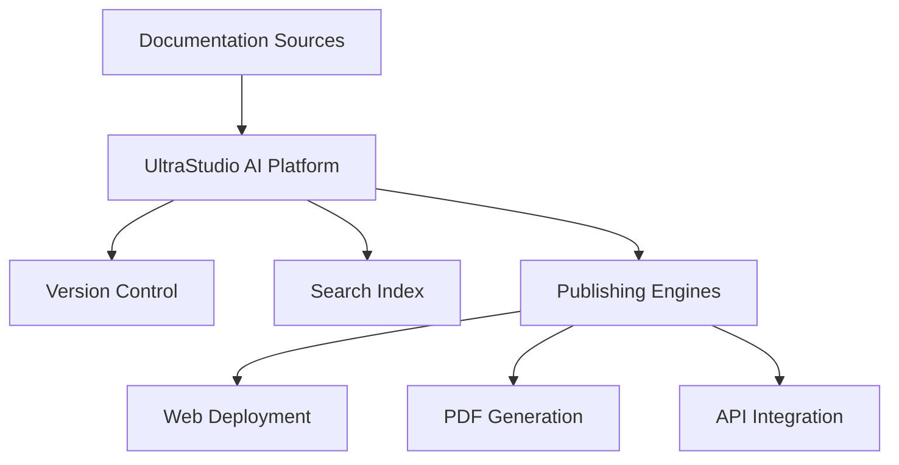

## Welcome to UltraStudio AI

UltraStudio AI Documentation provides a comprehensive platform for organizing, managing, and publishing your project documentation. Whether you're building APIs, creating user guides, or maintaining developer resources, our platform streamlines the entire documentation workflow.

<Columns cols="2">
  <Card title="Creating Your Account" href="#organization" icon="folder" cta="Learn More" target="_self">
    Structure your documentation with intuitive navigation and powerful search capabilities.
  </Card>

  <Card title="Managing Subscriptions" href="#collaboration" icon="users" cta="Get Started" target="_self">
    Work together with your team in real-time with version control and review processes.
  </Card>

  <Card title="Platform Features" href="#publishing" icon="globe" cta="Explore Options" target="_self">
    Deploy documentation to multiple platforms with automated publishing workflows.
  </Card>

  <Card title="AI Models" horizontal="false" target="_self">
    Card description...
  </Card>
</Columns>

## Key Features

<Steps>
  <Step title="Import Existing Docs" icon="upload" title-type="p">
    Bring your current documentation into UltraStudio AI with our import tools. Support for Markdown, OpenAPI specs, and popular formats.
  </Step>

  <Step title="Customize Navigation" icon="settings" title-type="p">
    Create custom navigation structures with tabs, groups, and nested sections to match your project's needs.
  </Step>

  <Step title="Integrate APIs" icon="plug" title-type="p">
    Automatically generate API documentation from OpenAPI specifications and embed interactive examples.
  </Step>

  <Step title="Publish & Share" icon="share-2" title-type="p">
    Publish to web, PDF, or integrate with your existing developer portal with one click.
  </Step>
</Steps>

## Getting Started

<Tabs>
  <Tab title="Quick Setup" icon="zap">
    Get up and running in minutes with our guided setup process.

    <Expandable title="Prerequisites" default-open="true">
      - A GitHub or GitLab account for version control

      - Your documentation source files (Markdown, OpenAPI, etc.)

      - Basic knowledge of Markdown syntax
    </Expandable>
  </Tab>

  <Tab title="Advanced Configuration" icon="settings">
    For teams needing custom integrations or enterprise features.

    <Expandable title="Enterprise Options" default-open="false">
      Configure SSO, custom domains, and advanced security settings.
    </Expandable>
  </Tab>
</Tabs>

Start with our interactive tutorial to explore all features hands-on.

<ExpandableGroup>
  <Expandable title="Frequently Asked Questions" default-open="false">
    <Expandable title="What formats are supported?" default-open="false">
      We support Markdown, OpenAPI YAML/JSON, and can import from popular tools like GitBook and ReadMe.
    </Expandable>

    <Expandable title="Is there a free tier?" default-open="false">
      Yes, our starter plan is free for personal projects with basic features.
    </Expandable>
  </Expandable>
</ExpandableGroup>

## Architecture Overview

This platform acts as the central hub for all your documentation needs, connecting your content sources to multiple output formats and distribution channels.
